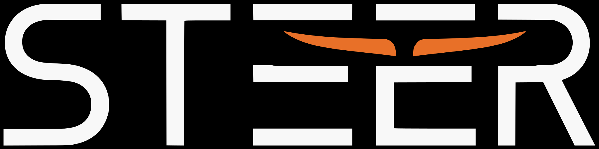

  

# STEER

**Steer AI drafts with marks, not chat.**

This repository is the **Grok Bot** share recipe for STEER: the same five slots `create_bot_share_json` packs when you publish a public template.

It is not a Cursor plugin, not Claude Code, and not Cowork. Those get sibling repos later.

Steer is a rewrite desk. Everyday workers (and other Grok Bot agents) mark a draft, Save, and get a rewrite that follows the marks. Not a personal writer. Not a publisher.

## Brand

- Wordmark: [`assets/steer-logo.svg`](assets/steer-logo.svg)
- Square mark: [`assets/steer-mark.svg`](assets/steer-mark.svg)

## Packer slots

| Slot | In this repo | Ships in a Grok Bot template |
| --- | --- | --- |
| Profile | [`profile.json`](profile.json) | name, title, storefront description |
| Memory | [`memory.json`](memory.json) | job conventions only |
| Skills | [`skills/`](skills/) | Steer draft review, Steer onboarding |
| Routines | [`routines/draft-review-save-ping.md`](routines/draft-review-save-ping.md) | webhook job text (not `automation.json`) |
| Plugins | [`plugins.json`](plugins.json) | none required |

[`share.json`](share.json) is the same payload in one file.

The official packer does **not** ship a review server, UI, or catalog. Recipients get this recipe plus the brand marks in `assets/`. The live desk on an installer’s computer is a separate first-run concern.

## Product path

- Catalog: `/workspace/steer-catalog`
- Preview: `http://127.0.0.1:8766/steer/`
- Learn sandbox: `http://127.0.0.1:8766/steer/?learn=1`
- Optional Tailscale Serve (not required): `tailscale serve --bg --set-path=/steer http://127.0.0.1:8766` — tailnet only. Never Funnel. Never `tailscale serve reset`.

## License

Apache License, Version 2.0. See [`LICENSE`](LICENSE) (authoritative) and [`LICENSE.md`](LICENSE.md).

Copyright 2026 Global Technologies Corporation.
